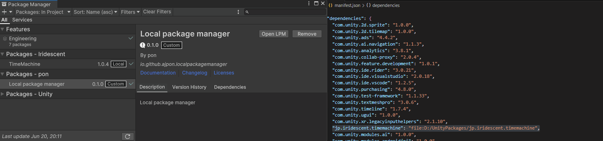
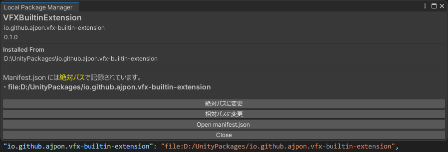

# UPM_LocalPackageManager
```
https://github.com/AJpon/UPM_LocalPackageManager.git
```
## 概要
Local Package Manager(以下LPM)は、UPMでローカルパッケージの参照を絶対パスか相対パスに簡単に変更できるツールです。

UPMでローカルパッケージを追加すると、パッケージのパスが`manifest.json`に記録されます。通常は絶対パスが記録されますが、`manifest.json`を直接変更することで相対パスを使用することもできます。  
しかし、パッケージの参照方式の変更や確認は手作業で行う必要がありました。

LPMはUPMでローカルパッケージを追加するときに、参照方式を選択できるようにします。  
また、UPMで選択した追加済みローカルパッケージの参照をGUIで確認、変更できるようにします。



## 要件
Unity 2022.3.0f1 以上

## インストール
UPMを使用してインストールします。
1. `Window` > `Package Manager` を開きます。
2. `+` > `Add package from git URL...` を選択します。
3. ```https://github.com/AJpon/UPM_LocalPackageManager.git``` を入力し、`Add` を押すことで最新版がインストールされます。

## 使い方
UPM上でパッケージを選択し、`Open LPM`を押すとLPMが開きます。ローカルパッケージの追加時には自動で開きます。  
LPMでは`manifest.json`の`dependencies`に記録されたパスの形式をGUIで確認、変更できます。  
`Open manifest.json`を押すとUnityで設定したデフォルトのエディタで`manifest.json`を開きます。



## 注意事項
- LPMは`manifest.json`の`dependencies`の参照パス部分を変更するだけで、パッケージのインストールやアンインストールは行いません。
- 相対パスで示せない場所にインストールされたパッケージは、相対パスに変更することはできません。その場合、絶対パスを使用します。
    - ドライブパスが異なる場合などが該当します。

## License
[MIT License](./LICENSE.md)  
Copyright (c) 2023 pon
